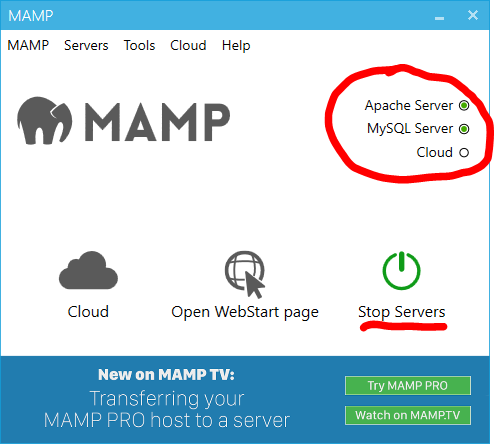

# Introduction au WEB - Back

## Applications à télécharger et installer :
- Visual Studio Code : [lien](https://code.visualstudio.com/download)
- MAMP (serveur) : [lien](https://www.mamp.info/fr/downloads/)
- Ngrok : [lien](https://ngrok.com/download)


## Base
Après la [configuration](ressources/installation_MAMP_VSCode.md) vous avez normalement votre serveur MAMP qui est lancé et qui tourne.  
Vous pouvez le savoir car les deux petit boutons vert apparaissent sur l'application :  

  

Si ce n'est pas le cas veillez à bien avoir lancé les serveurs (le gros boutton vert).  
Sinon essayez de redémarrer l'application.  


## Ensuite
Avec **VSCode**, ouvrez le dossier `C:\MAMP\htdocs` créez un fichier vierge et tapez `! + Entrée`.  
Normalement le code suivant doit apparaître (s'il est un peu différent, ce n'est pas grave) :
```html
<!DOCTYPE html>
<html lang="en">
<head>
    <meta charset="UTF-8">
    <meta name="viewport" content="width=device-width, initial-scale=1.0">
    <title>Document</title>
</head>
<body>
    
</body>
</html>
```

(si ce n'est pas le cas alors copier-coller le code ci-dessus)  

Puis ouvrez votre navigateur et allez à l'adresse `localhost`.  
Enfin rajouter le bout de code suivant là où vous voulez ajouter du `php` (en général entre les balises `<body> </body>`):

```php
<?php

?>
```
Vous avez maintenant une base pour travailler.  
## Doc php ici : [https://www.php.net/](https://www.php.net/)

# Modalités de notation

- un projet global noté
- 3 TP suivis notés de 3h précédés d'une intro de maximum 45 minutes
  - 1er : vendredi 15 octobre
  - 2nd : mercredi 8 décembre
  - 3ème : mercredi 15 décembre
- la dernière séance > `Jeudi 11 Janvier 2022 de 13h30 à 15h30` < Il y aura un **QCM d'une heure** qui constituera la note finale de cet enseignement
- nous profiterons du temps restant pour que je vous donne des conseils afin de finaliser les projets.
