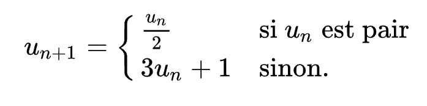

# TP2

Veillez à bien travailler dans les conditions décrites dans le [Readme](../README.md) de ce dépôt github.  

Vous avez un fichier ouvert dans `C:\MAMP\htdocs` avec la base html suivante :  
```html
<!DOCTYPE html>
<html lang="en">
<head>
    <meta charset="UTF-8">
    <meta name="viewport" content="width=device-width, initial-scale=1.0">
    <title>Document</title>
</head>
<body>
    
</body>
</html>
```

**Tout** le reste ne sera que du code PHP.
Vous n'aurez **pas** à écrire du HTML si ce n'est comme ceci :  
```php
echo "<maBalise> mesTrucs </maBalise>";
```

___
# A vous de jouer
## Exercice 1 : Recherche dans une liste

**Q1** => Reprenez le code fourni et remplissez la fonction : `rechercheTab($tab, $str)`.  
Cette fonction renvoie le 1er élément trouvé qui contient la sous-chaîne `str` dans le tableau donné.

**Indications données à l'oral**

___
## Exercice 2 : Liste circulaire

Les listes circulaires sont très pratiques pour se "souvenir" d'un nombre limité d'informations. Imaginons que nous voulons sauvegarder des phrases écrites dans un Tchat éphémère, mais que nous ayons une mémoire limitée à 5 blocs. Il faudrait s'assurer de ne garder que les 5 dernières phrases écrites pour les afficher.  
Le code ci-dessus simule cette mémoire avec le tableau `$circularArray`. L'idée est d'ajouter une phrase `$sentence` au tableau. Sans **jamais** agrandir le tableau. C'est pourquoi nous avons la variable `$indexCircularArray` qui se souviendra du dernier emplacement où l'on a ajouté la dernière phrase.


**Q1** => Remplissez les fonctions dans le code fourni.  

**Q2** => **bonus :** modifiez le code pour qu'il n'utilise plus de `global`. Vous ferez en sorte que les fonctions prennent en argument n'importequel tableau (en le passant par **référence**) avec un index donné  

___
## Exercice 3 : Suite de Collatz
<br/><legend>Lothar Collatz - 1990</legend></img><br/>


Dans cet exercice vous allez construire la suite de collatz.  
Voici sa définition mathématique :  
<br/>

**Q1** => Reprenez la fonction `collatz($myNumber)`. Celle-ci prend un **nombre entier positif** en argument et qui dans une boucle, construit la suite décrite ci-dessus. La fonction affiche le tableau de chaque nombres calculés.  
**Indication** : dans votre fonction, vous aurez une boucle "`while`" qui s'arrête quand -> votre nombre == `1`.

___
## Exercice 4 : Touché - Coulé

Vous avez un petit jeu de "touché - coulé". Vous aurez deux fonctions à coder `tir($arr, $coordX, $coordY)` et `printBoard($twoDimTab)`.  
Dans le code vous avez une variable `$myArray` qui contient déjà un tableau de jeu tout fait.

**Q1** => Reprenez ces fonctions et remplissez-les :  
* `tir()` affiche `touché` si les coordonnées sont à `1`, sinon `coulé`.
* `printBoard()` affiche le tableau joliement.


<details>
  <summary><b>BONUS</b></summary>
    <i>=> Codez la fonction <code>generateBoard($size, $arrayCrds)</code> qui prend une taille en 1er argument et un tableau de coordonnées (là où se trouvent les "<code>1</code>"). Cette fonction renvoie un tableau 2 dimensions de taille <code>size*size</code></i>
</details>