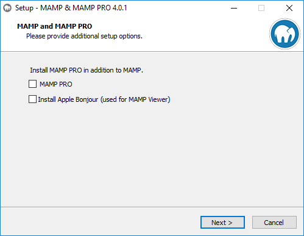
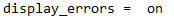
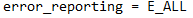
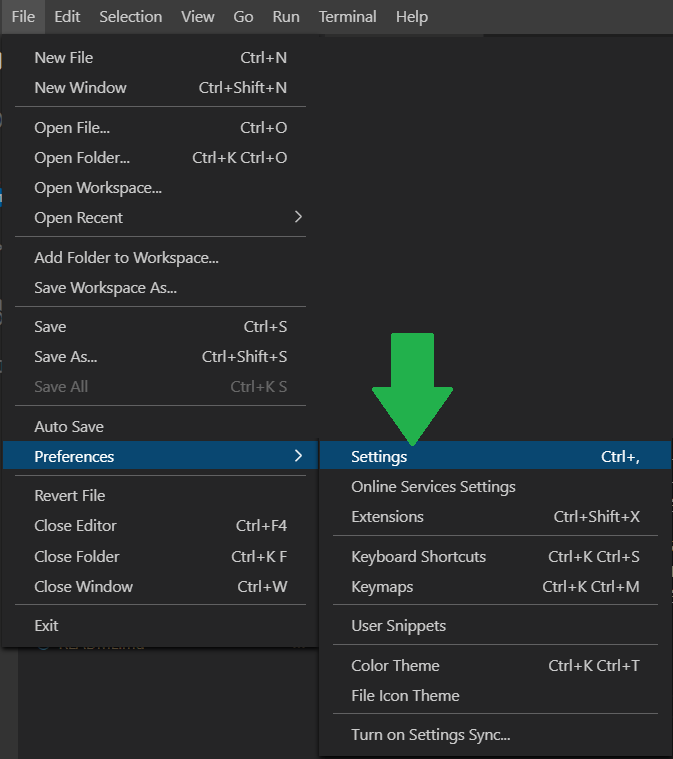
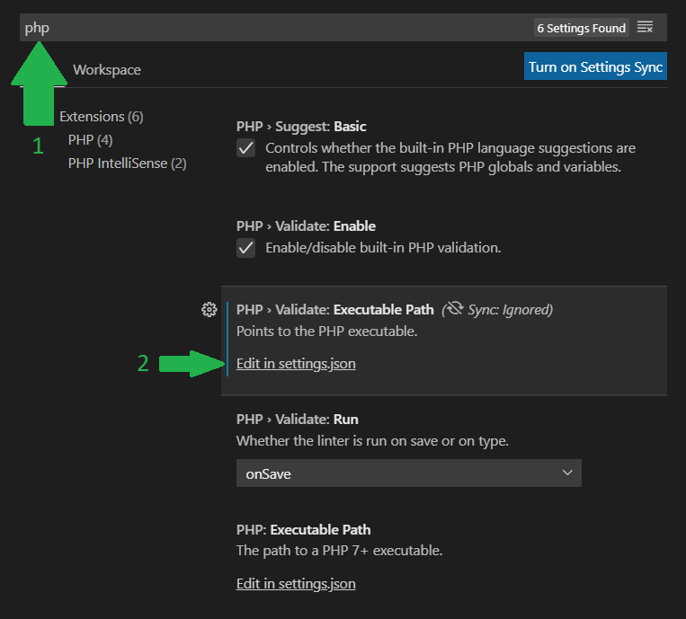
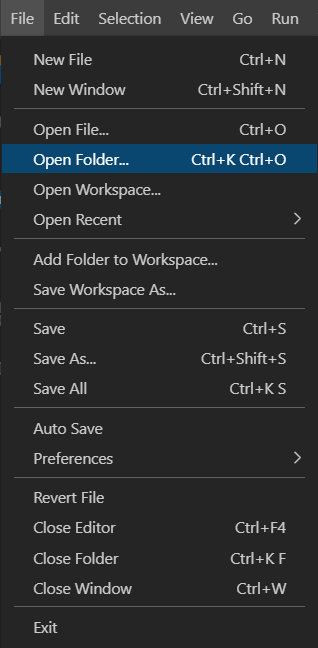

# Installation et configuration de MAMP et VSCode

## MAMP
Après avoir lancé l'exécutable, le seul écran qui nous intéresse est le suivant :  



Veillez à **décocher** les cases avant de faire Next.  
Après l'installation, on passe à une modification **importante**.
## La config interne

Normalement WAMP est installé à cet emplacement : `C:\MAMP` (ou `/Applications/MAMP` sous MAC)  
Allez ici : `C:\MAMP\conf\php7.4.1`  
Dans le dossier `conf\` normalement le dossier `php7.4.1\` est celui tout en bas de la liste (mais ce peut être `php7.4.2` dans tout les cas **notez la version**, ici c'est `7.4.2`).  

Faites un **clique gauche** sur `php.ini` et choisissez **modifier**.  
Faites `Ctrl+F` et cherchez le champ : `display_errors`  
Il se trouve normalement à la ligne 374 (il ne faut pas qu'il y ait de "`;`" au début de la ligne).  
Vérifiez que la valeur est bien `on`.  


Juste au dessus à la ligne 355 il y a le champ `error_reporting`. Vérifier que sa valeur est bien `E_ALL`.  


## Dans VScode

Il faut aller dans les **Settings**.



Puis tapez `php` dans la barre de recherche et cliquez sur `Edit in settings.json`



Puis insérez le code suivant.
### Sous Windows
```json
{
    "php.validate.executablePath": "C:\\MAMP\\bin\\php\\php7.4.1\\php",
    "php.executablePath": "C:\\MAMP\\bin\\php\\php7.4.1\\php"
}
```
### Sous MAC
```json
{
    "php.validate.executablePath": "/Applications/MAMP/bin/php/php7.4.1/php",
    "php.executablePath": "/Applications/MAMP/bin/php/php7.4.1/php"
}
```

**Attention** : Si vous aviez une version différente pour le dossier `phpX.X.X/` à l'étape de modification du fichier `php.ini`, remplacez dans le code au dessus la version qui correspond au dossier choisit plus haut.  

## Ouvrez le bon dossier

Ouvrez le dossier `C:\MAMP\htdocs` avec VSCode  




### Vous pouvez maintenant travailler.